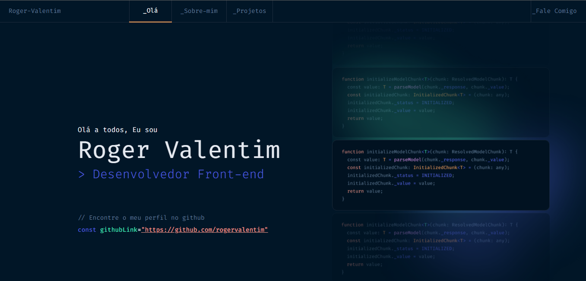

<h1 align="center">
  💻 Portfólio - Roger Valentim
</h1>

<h3 align="center"><a href="https://roger-valentim.vercel.app/">Clique para visitar o projeto</a></h3>

## 📚 Seções

O site é composto por seis seções:

- **Home:** Nele temos uma breve apresentação;
- **Quem sou:** Nessa seção tenho uma descrição dizendo um pouco sobre quem sou;
- **Projetos:** Apresenta alguns projetos desenvolvidos e com link direto para os respectivos projetos;

---

## 💼 Tecnologias utilizadas

Para o desenvolvimento deste site utilizei as seguintes tecnologias:

- React;
- React-icons;
- Css;
- JavaScript;

---

<h2>👩‍💻 Autor</h2>

<table>
  <tr>
    <td align="center">
      <a href="https://github.com/rogervalentim">
         
        
          <b>Roger Valentim</b>
        
      </a>
    </td>
  </tr>
</table>
